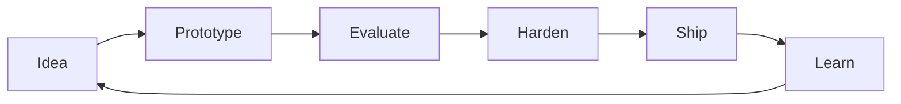

<div align="center">


<br />


<br />
<br />


</div>

---

### Focus

```txt
AI        -> agentic workflows, applied LLM systems, evaluation loops
SWE       -> clean architecture, backend systems, product-grade tooling
Automation -> reliable pipelines, developer workflows, operational leverage
```

### Operating mode

<table>
  <tr>
    <td>Build</td>
    <td>small useful systems, then harden what survives contact with reality</td>
  </tr>
  <tr>
    <td>Think</td>
    <td>interfaces first, failure modes early, tests where risk is highest</td>
  </tr>
  <tr>
    <td>Ship</td>
    <td>clear scope, measurable behavior, boring reliability</td>
  </tr>
</table>

### Stack signal

<div align="center">


</div>

---

<div align="center">



</div>

<div align="center">

<sub>AI • SWE • systems that earn their keep</sub>

</div>
